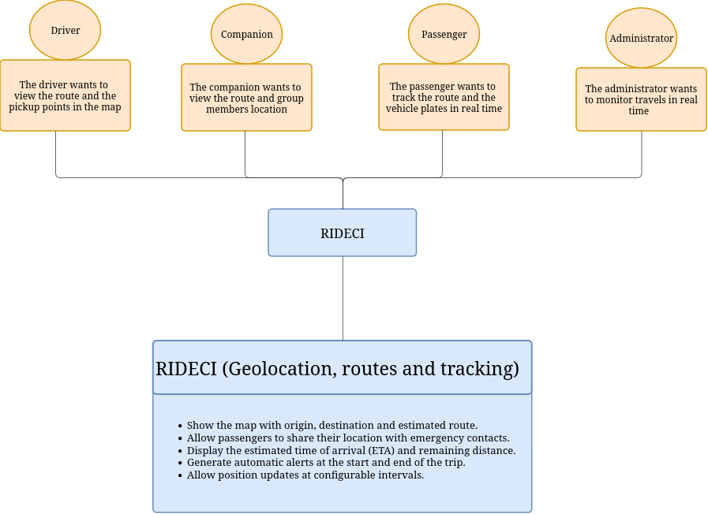
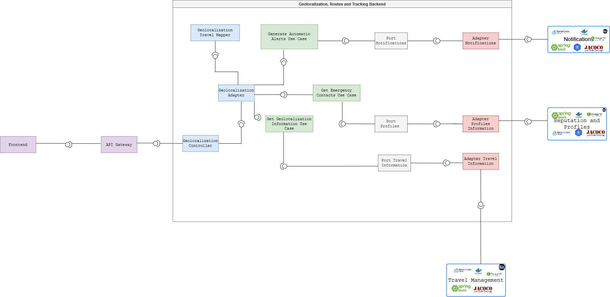
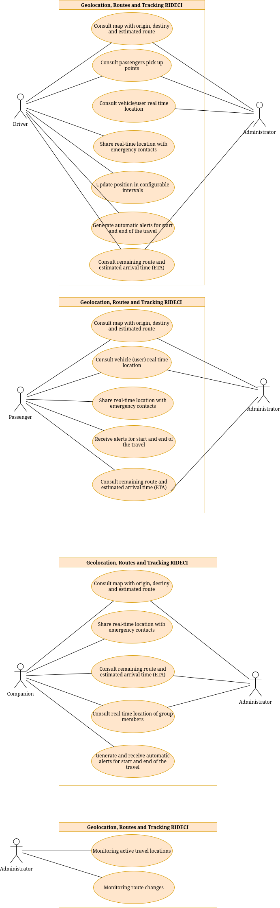
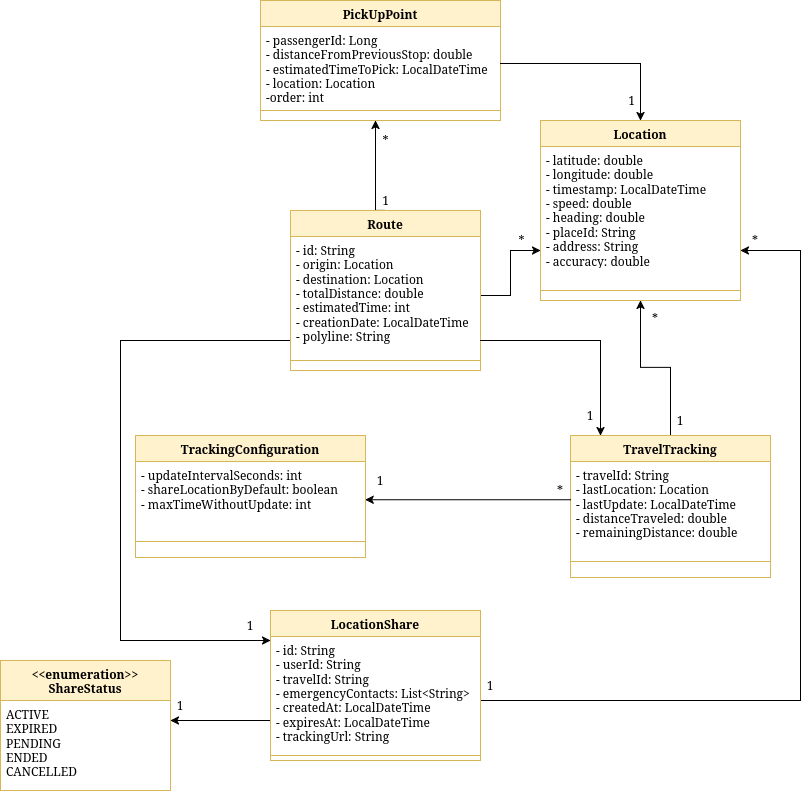
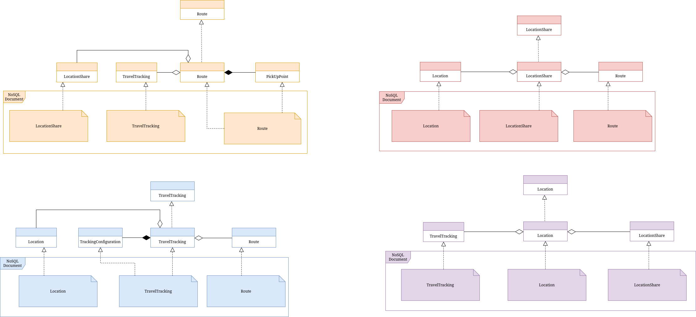
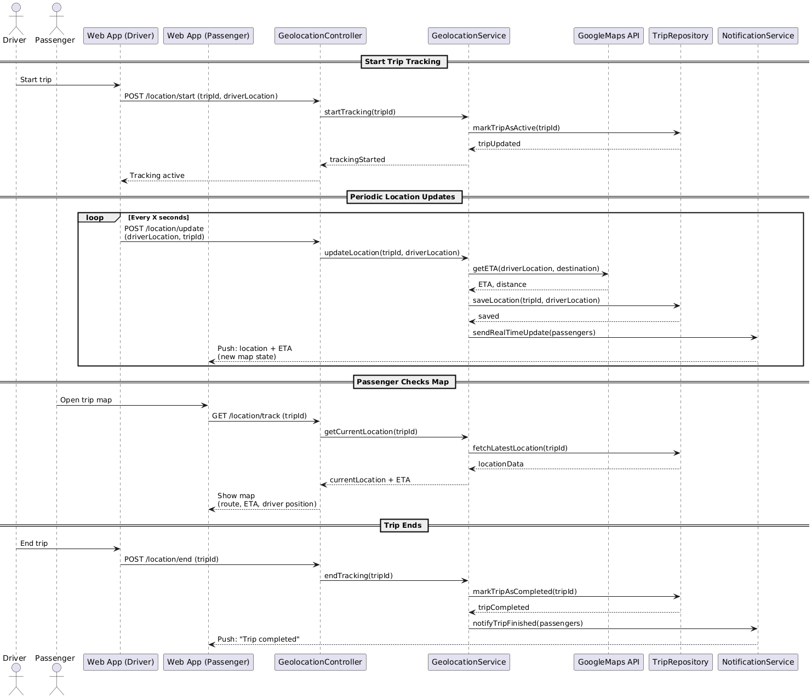
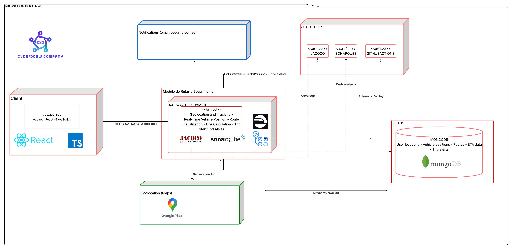

# 📍 Nemesis - Geolocation, Routes and Tracking Backend

This module is designed to allow real-time visualization of the vehicle's route and the location of passengers. It facilitates route tracking by displaying progress, estimated time, and generating and receiving start and arrival alerts for each trip.

## 👥 Developers

- Santiago Carmona Pineda
- Tulio Riaño Sanchez
- Daniel Patiño Mejia
- Juan Felipe Rangel Rodriguez


## 📑 Content Table

1. [Project Architecture](#-project-architecture)
    - [Hexagonal Structure](#-clean---hexagonal-structure)
2. [API Documentation](#-api-endpoints)
    - [Endpoints](#-api-endpoints)
3. [Input & Output Data](#input-and-output-data)
4. [Microservices Integration](#-connections-with-other-microservices)
5. [Technologies](#technologies)
6. [Branch Strategy](#-branches-strategy--structure)
7. [System Architecture & Design](#-system-architecture--design) 
8. [Getting Started](#-getting-started) 
9. [Testing](#-testing)

---
## 🏛️ Project Architecture

The Nemesis - Geolocation, Routes and Tracking have a unacoplated hexagonal - clean architecture where looks for isolate the business logic with the other part of the app dividing it in multiple components:

* **🧠 Domain (Core)**: Contains the business logic and principal rules.

* **🎯 Ports (Interfaces)**: Are interfaces that define the actions that the domain can do.

* **🔌 Adapters (Infrastructure)**: Are the implementations of the ports that connect the domain with the specific technologies. 

The use of this architecture has the following benefits:

* ✅ **Separation of Concerns:** Distinct boundaries between logic and infrastructure.
* ✅ **Maintainability:** Easier to update or replace specific components.
* ✅ **Scalability:** Components can evolve independently.
* ✅ **Testability:** The domain can be tested in isolation without a database or server.

## 📂 Clean - Hexagonal Structure

```
📂 nemesis_travel_management_backend
 ┣ 📂 src/
 ┃ ┣ 📂 main/
 ┃ ┃ ┣ 📂 java/
 ┃ ┃ ┃ ┗ 📂 edu/dosw/rideci/
 ┃ ┃ ┃   ┣ 📄 NemesisTravelManagementBackendApplication.java
 ┃ ┃ ┃   ┣ 📂 domain/
 ┃ ┃ ┃   ┃ ┗ 📂 model/            # 🧠 Domain models
 ┃ ┃ ┃   ┣ 📂 application/
 ┃ ┃ ┃   ┃ ┣ 📂 ports/
 ┃ ┃ ┃   ┃ ┃ ┣ 📂 input/          # 🎯 Input ports (Exposed use cases)
 ┃ ┃ ┃   ┃ ┃ ┗ 📂 output/         # 🔌 Output ports (external gateways)
 ┃ ┃ ┃   ┃ ┗ 📂 usecases/         # ⚙️ Use case implementations
 ┃ ┃ ┃   ┣ 📂 infrastructure/
 ┃ ┃ ┃   ┃ ┗ 📂 adapters/
 ┃ ┃ ┃   ┃   ┣ 📂 input/
 ┃ ┃ ┃   ┃   ┃ ┗ 📂 controller/   # 🌐 Input adapters (REST controllers)
 ┃ ┃ ┃   ┃   ┗ 📂 output/
 ┃ ┃ ┃   ┃     ┗ 📂 persistence/  # 🗄️ Output adapters (persistance)
 ┃ ┃ ┗ 📂 resources/
 ┃ ┃   ┗ 📄 application.properties
 ┣ 📂 test/
 ┃ ┣ 📂 java/
 ┃ ┃ ┗ 📂 edu/dosw/rideci/NEMESIS_TRAVEL_MANAGEMENT_BACKEND/
 ┃ ┃   ┗ 📄 NemesisTravelManagementBackendApplicationTests.java
 ┣ 📂 docs/
 ┃ ┣ diagramaClases.jpg
 ┃ ┣ diagramaDatos.jpg
 ┃ ┗ diagramaDespliegue.png
 ┣ 📄 pom.xml
 ┣ 📄 mvnw / mvnw.cmd
 ┗ 📄 README.md
```

# 📡 API Endpoints

For detailed documentation refer to our Swagger UI (Running locally at http://localhost:8080/swagger-ui.html).

Data input & output

| Method | URI | Description | Request Body / Params |
| :--- | :--- | :--- | :--- |
| `POST` | `/api/v1/routes/calculate` | Calculates the best route between two coordinates. | `{ "origin": { "lat": ..., "lng": ... }, "destination": { ... } }` |
| `GET` | `/api/v1/routes/{routeId}` | Retrieves details of a previously calculated route. | `routeId` (Path Variable) |
| `GET` | `/api/v1/routes/preview` | Returns a lightweight polyline preview for the map. | `?origin=...&dest=...` (Query Params)


### 📟 HTTP Status Codes
Common status codes returned by the API.

| Code | Status | Description |
| :--- | :--- | :--- |
| `200` | **OK** | Request processed successfully. |
| `201` | **Created** | Resource (Route/Tracking) created successfully. |
| `400` | **Bad Request** | Invalid coordinates or missing parameters. |
| `401` | **Unauthorized** | Missing or invalid JWT token. |
| `404` | **Not Found** | Route or Trip ID does not exist. |
| `500` | **Internal Server Error** | Unexpected error (e.g., Google Maps API failure).

# Input and Output Data

Data information per functionability


# 🔗 Connections with other Microservices

This module does not work alone. It interacts with the RideCi Ecosystem via REST APIs and Message Brokers:

1. Travel Management Module: Receives information about the travel.

# Technologies

The following technologies were used to build and deploy this module:

### Backend & Core


### Database


### DevOps & Infrastructure


### CI/CD & Quality Assurance


### Documentation & Testing


### Design 


### Comunication & Project Management


---

# 🌿 Branches Strategy & Structure

This module follows a strict branching strategy based on Gitflow to ensure the ordered versioning,code quality and continous integration.


| **Branch**                | **Purpose**                            | **Receive of**           | **Sent to**        | **Notes**                      |
| ----------------------- | ---------------------------------------- | ----------------------- | ------------------ | ------------------------------ |
| `main`                  | 🏁 Stable code for preproduction or Production | `release/*`, `hotfix/*` | 🚀 Production      | 🔐 Protected with PR y successful CI   |
| `develop`               | 🧪 Main developing branch             | `feature/*`             | `release/*`        | 🔄 Base to continous deployment |
| `feature/*`             | ✨ New functions or refactors  to be implemented       | `develop`               | `develop`          | 🧹 Are deleted after merge to develop      |
| `release/*`             | 📦 Release preparation & final polish.      | `develop`               | `main` y `develop` | 🧪  Includes final QA. No new features added here.     |
| `bugfix/*` o `hotfix/*` | 🛠️ Critical fixes for production         | `main`                  | `main` y `develop` | ⚡ Urgent patches. Highest priority             |


# 🏷️ Naming Conventions

## 🌿 Branch Naming

### ✨ Feature Branches
Used for new features or non-critical improvements.

**Format:**
`feature/[shortDescription]`

**Examples:**
- `feature/authenticationModule`
- `feature/securityService`

**Rules:**
* 🧩 **Case:** strictly *camelCase* (lowercase with hyphens).
* ✍️ **Descriptive:** Short and meaningful description.
---

### 📦 Release Branches
Used for preparing a new production release. Follows [Semantic Versioning](https://semver.org/).

**Format:**
`release/v[major].[minor].[patch]`

**Examples:**
- `release/v1.0.0`
- `release/v1.1.0-beta`

---

### 🚑 Hotfix Branches
Used for urgent fixes in the production environment.

**Format:**
`hotfix/[shortDescription]`

**Examples:**
- `hotfix/fixTokenExpiration`
- `hotfix/securityPatch`

---

## 📝 Commit Message Guidelines

We follow the **[Conventional Commits](https://www.conventionalcommits.org/)** specification.

### 🧱 Standard Format

```text
<type>(<scope>): <short description>
```

# 📐 System Architecture & Design

This section provides a visual representation of the module's architecture ilustrating the base diagrams to show the application structure and components flow.


### 🧩 Context Diagram
---
Text



### 🧩 Specific Components Diagram
---
This diagram visualizes the dependencies between classes for developing the module's logic. It includes the following components:

* Controllers:
    * Geolocalization Controller: This controller receives and manages all requests related to geolocation management, routes, and tracking, including references handled via DTOs.

When applying a hexagonal architecture, before developing the use cases, we need adapter components:

* Adapter:

    * Geolocalization Adapter: Contracts (interfaces) are defined based on the input received from the controllers.

    * Mapper Adapter: This adapter transforms data types from one object to another for use in the respective use cases.

* Use Cases:

    * Get Emergency Contacts Use Case: Implementation to allow passengers to share their location with emergency contacts.

    * Get Geolocation Information Use Case: Obtain position information at regular intervals.

    * Generate Automatic Alerts Use Case: Generate automatic alerts at the beginning and end of the trip.

* Ports: The following interfaces were defined as the data we will receive from the outside:

    * Port Notifications

    * Port Profiles

    * Port Travel Information



### 🧩 Use Cases Diagram
---
This diagram presents the main functionalities defined by each actor. This facilitates a better understanding when implementing the module's multiple functions, as well as identifying and separating each actor's roles when using the application.



### 🧩 Class Diagram
---
Based on the Specific Components diagram, we created the class diagram, where we defined an Observer design pattern that will notify all passengers already registered on the trip, allowing them to view the current location at certain intervals, and all the information about the estimated route, the distance traveled, and so on.



### 🧩 Data Base Diagram
---

This diagram represents how the data is stored, where we will find the multiple documents, and the data that will be stored in an embedded or referenced manner.




### 🧩 Sequence Diagrams
---
This diagram presents the complete CRUD workflow for trip geolocation. It includes sequence diagrams for initiating, updating, and ending a trip.

The diagram also details the required validations and potential errors that may occur in each functionality. Finally, it illustrates the components involved in each process, including the Google Maps API and the relationship between them.




### 🧩 Specific Deploy Diagram
---
This diagram illustrates the cloud deployment architecture and workflow of the geolocation, routes and tracking module.


# 🚀 Getting Started

This section guides you through setting ip the project locally. This project requires **Java 17**. If you have a different version, you can change it or we recommend using **Docker** to ensure compatibility before compile.

### Clone & open repository

``` bash
git clone https://github.com/RIDECI/NEMESIS_ROUTES_AND_TRACKING_BACKEND.git
```

``` bash
cd NEMESIS_ROUTES_AND_TRACKING_BACKEND
```

You can open it on your favorite IDE

### Dockerize the project

Dockerize before compile the project avoid configuration issues and ensure environment consistency.

``` bash
docker compose up -d
```

### Install dependencies & compile project

Download dependencies and compile the source code.

``` bash
mvn clean install
```

``` bash
mvn clean compile
```

### To run the project
Start the Spring Boot server

``` bash
mvn spring-boot:run
```


# 🧪 Testing

Testing is a essential part of the project functionability, this part will show the code coverage and code quality analazing with tools like JaCoCo and SonarQube.

### 📊 Code Coverage (JaCoCo)
---


### 🔍 Static Analysis (SonarQube)
